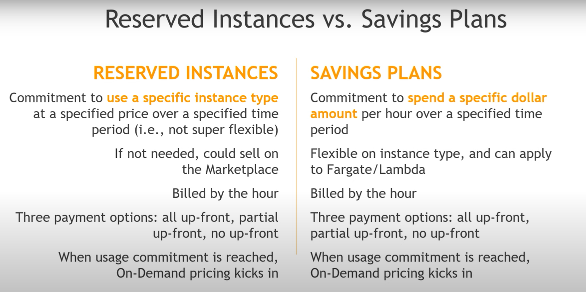

<h1> Things to do </h1>

- Provide date on which the document was last edited
- Provide reference for the information
- Provide video link for the hands-on labs
---

- [Prequesite: Cost Evaluation and Budget Management using Budget templates (docs)](#prequesite-cost-evaluation-and-budget-management-using-budget-templates-docs)
    - [Type of Budget Templates](#type-of-budget-templates)
- [Introduction](#introduction)
- [Creating an EC2 Instance:](#creating-an-ec2-instance)
- [Instance Types (docs)](#instance-types-docs)
    - [Types](#types)
- [Security Groups (SG)](#security-groups-sg)
- [EC2 Purchasing Options (docs)](#ec2-purchasing-options-docs)
- [Important Ports](#important-ports)
- [References](#references)

# Prequesite: Cost Evaluation and Budget Management using Budget templates ([docs](https://docs.aws.amazon.com/cost-management/latest/userguide/budget-templates.html))
- By default IAM users aren't allowed access to the Billing and Cost Management console, it can be allowed from the **Root user > Account Settings > IAM User and Role Access to Billing Information**.
- an AWS Budget can either be created using following options:
  - **Template:** A preconfigured template that will cover general cost scenarios and alarms (recommended for general cases). the information passed to the template can later be changed as well.
  - **Customize:** To build a budget specific to your use case.
    
  ### Type of Budget Templates
- **Zero spend budget:** A budget that notifies you after your spending exceeds AWS Free Tier limits.
- **Monthly cost budget:** A monthly budget that notifies you if you exceed, or are forecasted to exceed, the budget amount.
- **Daily Savings Plans coverage budget:** A coverage budget for your Savings Plans that notifies you when you fall below the defined savings target. This helps you to identify your on-demand spend sooner so that you can consider purchasing a new commitment.
- **Daily reservation utilization budget:** A utilization budget for your Reserved Instances that notifies you when you fall below the defined target. This helps you to identify when you're not using some of your hourly commitment that you already purchased.
- [Best Practices for AWS Budget](https://docs.aws.amazon.com/cost-management/latest/userguide/budgets-best-practices.html)
  
# Introduction
- EC2 stands for Elastic Compute Cloud (an Infrastructure as a Service)
- Functionalities offered by EC2
  - Renting Virtual Machines (EC2)
  - Storing data on Virtual Drives (EBS - Elastic Block Storage)
  - Load Distribution Accross Machines (ELB - Elastic Load Balancer)
  - Automatic scaling of service (ASG - Auto Scaling Groups)
- Configuration Options:
  - The Operating System for VMs
  - RAM for the VMs
  - Storage space:
    - Network attached (EBS or EFS - Elastic File System)
    - direct hardware attached (EC2 Instance Store)
  - Network card with IP and bandwidth
  - Security Groups aka Firewalls for VMs
  - **User Data**: A Bootstrap Script for initializing the VMs with some specific software configuration like installing/updating some tools or libraries.
    - User Data scripts only run once i.e when the VM is booted for the very first time.
    - Runs with the root user by default
# Creating an EC2 Instance:
- [Hands on Lab by Cloud Champ](https://docs.aws.amazon.com/AWSEC2/latest/UserGuide/instance-purchasing-options.html)
- Things to Note:
  - Starting and Stopping an Instance will change its Public IP but not Private IP.
  - If an EC2 wants to access an IAM User, it is better to pass a role to the instance from `Actions > Security > Modify IAM Role` which grants access to IAM User rather than passing Credentials directly in the Instance.
# Instance Types ([docs](https://aws.amazon.com/ec2/instance-types/))
- Naming convention generally follows pattern: 
    (**Instance class**) (**Generation**) (**Instance size**) 
    For ex: t2.micro
    t - Instance class, 2 - 2nd generation, micro - size
  ### Types
- **General Purpose:** They provide a balance of compute, memory and networking resources.
  - Ideal for tasks where the workload is distributed equally among this resources such as web-servers or code repositories
- **Compute Optimized:** Provides high processing performance for compute intensive tasks
  - Ideal for tasks such as Batch Processing workloads, Media Transcoding, High performing web-server, Dedicated Gaming servers, Scientific Modeling, High Performance Computing.
- **Memory Optimized:** Provides Fast Memory Perfromance for tasks that requires processing large data-sets in memory.
- **Accelerated Computing:** Uses dedicated [Hardware Accelerators](https://www.youtube.com/watch?v=g5KyFbUrSLU) to perform tasks for efficiently than it is possible on a normal CPU.
  - Tasks such as Graphics Processing, Data Pattern Matching, Floating Point Number Calculations etc.
- **Storage Optimized:** Provides high performance Read and Write access to very large datasets on local storage. 
  - Optimized to deliver tens of thousands of low-latency, random I/O operations per second (IOPS) to applications.
- **HPC (High Performance Computing) Optimized:** HPC instances are purposely built to offer the best price performance for running HPC workloads at scale on AWS.
  - HPC instances are ideal for applications that benefit from high-performance processors such as large, complex simulations and deep learning workloads.
  - Currently all of HPC Instance name are prefixed by "Hpc"
- **Instance Features:** Amazon EC2 instances provide a number of additional features to help you deploy, manage, and scale your applications. ([more here](https://aws.amazon.com/ec2/instance-types/#:~:text=Service%20(Amazon%20S3)-,Instance%20Features,-Amazon%20EC2%20instances))
- **Measuring Instance Performance:** [Things to consider while choosing an instance](https://aws.amazon.com/ec2/instance-types/#:~:text=Service%20(Amazon%20S3)-,Instance%20Features,-Amazon%20EC2%20instances)
- [A Usefull site for comparing instances](https://instances.vantage.sh/)

# Security Groups (SG)
- SGs are firewall that filter-out the inbound and outbound traffic based on the configuration provided in it.
- IMP Fields inside an SG:
  - **Type:** Specifies the Application Layer Protocols such as HTTP, HTTPS, SSH, FTP etc.
  - **Protocol:** Specifies the Network Layer Protocols such as TCP
  - **Port Range:** Can be a Single Port or a Range of Port
  - **Source/Destination:** The Entity sending/recieving the traffic. The value can be an IP or a reference to another SG.
  - **Description** (Optional)
- an SG can be attached to multiple instances
- resides inside the VPC/region only i.e an SG in one region/VPC can't be attached to an instance in different VPC/region.
- Generally, SGs are the cause of a request timeout.
- **Defaults: All inbound traffic - blocked and All outbound traffic - authorised**
- **Best Practices: Its good to maintain a totally different SG for SSH access**

# EC2 Purchasing Options ([docs](https://docs.aws.amazon.com/AWSEC2/latest/UserGuide/instance-purchasing-options.html))
- **On-Demand Instances:** With On-Demand Instances, you pay for compute capacity by the second with no long-term commitments. You have full control over the instance's lifecycle — you decide when to launch, stop, hibernate, start, reboot, or terminate it.
  - use On-Demand Instances for applications with short-term, irregular workloads that cannot be interrupted.
  - Most Expensive of all the plans
- **Reserved Instances:** Reserved instances are the instances that are tied up with a billing discount given that you are willing to reserve the instance over certain period. (1 year or 3 year plan as of now)
  - Provides upto 72% discount compared to On-Demand.
  - you must specify the instance attributes (i.e instance type, Region, Tenancy, OS) when reserving the instance and it does provide the flexibility to change some of this attributes later.
  - Scope: Regional or Zonal
  - Payment Options: No Upfront (low discount), Partial Upfront (mediocre discount), All Upfront (high discount)
  - Can be sold/bought in Reserved instance market place
  - **Convertible Reserved Instances:** Provides more flexibility for modifying attributes as well as to exchange the reserved instances.
    - Upto 66% discount compared to On-Demand.
    - Cannot be sold/bought in Reserved instance market place
- **Savings Plan:** It is almost similar to Reserved Instances except instead of commiting to specific instance attributes, you commit to a minimum spend/hr over a certain period (1 or 3 years as of now).
  - When the usage is exhausted, the On-Demand charges are applied (This is also true for reserved instances)
  - It is extendible to fargate and lambdas unlike reserved instances which are only bounded to EC2s.
  - [Difference between Reserved Instanecs and Savings Plans](https://youtu.be/-t148tYgnJU?t=167)
- **[Spot Instances:](https://docs.aws.amazon.com/AWSEC2/latest/UserGuide/using-spot-instances.html)** Spot instances are the intances that are offered on the unused EC2 capacity (i.e Ideal EC2s).
  - This instances are significantly cheaper compared to on-Demand with a discount upto 90%.
  - To reserve a spot instance, submit a spot request. when the capacity is available, your request will be fullfilled
    - One-time requests: request is cancled after an interruption 
    - Persistant requests: If an interrupt occur during the specified period(lifetime) of the request then a new request is automatically submitted.
  - you must bid a price higher than the current spot price(the price of instance at given time).
  - If someone bid a higher price for your instance, you'll lose your instance.
  - Once an interruption occur, the instance is released after 2 mins.
  - Spot Instances are well-suited for data analysis, batch jobs, background processing, and optional tasks. 
- **Dedicated Hosts:** Dedicated Host is a physical server that is fully dedicated for your use. You can optionally choose to share the instance capacity with other AWS accounts.
  - [Purchasing options:](https://docs.aws.amazon.com/AWSEC2/latest/UserGuide/dedicated-hosts-billing.html) can be On-Demand, Reserved, Savings Plan.
  - Better when you've strong compliance requirements or want to use your existing server bound licenses.
- **Dedicated Instances:** Dedicated Instances are EC2 instances that run on hardware that's dedicated to a single AWS account.
  - This means that Dedicated Instances are physically isolated at the host hardware level from instances that belong to other AWS accounts, even if those accounts are linked to a single payer account. However, Dedicated Instances might share hardware with other instances from the same AWS account that are not Dedicated Instances.
- [Difference between Dedicated Instances and Dedicated Host](https://docs.aws.amazon.com/AWSEC2/latest/UserGuide/dedicated-instance.html#:~:text=and%20Dedicated%20Hosts%3A-,Dedicated%20Host,-Dedicated%20Instance)
  
- **Capacity Reservations:** Capacity Reservations allow you to reserve compute capacity for Amazon EC2 instances in a specific Availability Zone. 
  - No time commitment and No billing discount like reserved instance, Although you can combine this with Regional reserved instances and Savings plan to benefit the billing discount.
  - Charged on On-Demand rate when the instance is running.
  - Suitable for short-term, uninterrupted workload that needs to be in specific AZ

# Important Ports
- **22:** SSH (Secure Shell Protocol) **and** SFTP (Secure File Transfer Protocol)
- **21:** FTP (File Transfer Protocol)
- **80:** HTTP (Hyper Text Transfer Protocol)
- **443:** HTTPS (HTTP Secure)
- **3389:** RDP (Remote Desktop Protocol)

# References
- [AWS Docs](https://docs.aws.amazon.com/AWSEC2/latest/UserGuide/concepts.html)
- [AWS Notes by Tahseer](https://arkalim.notion.site/EC2-0248f474aa154ae8b076725e1178d1b8#28a3a0b2c4df4819ae04ff116103a3da)