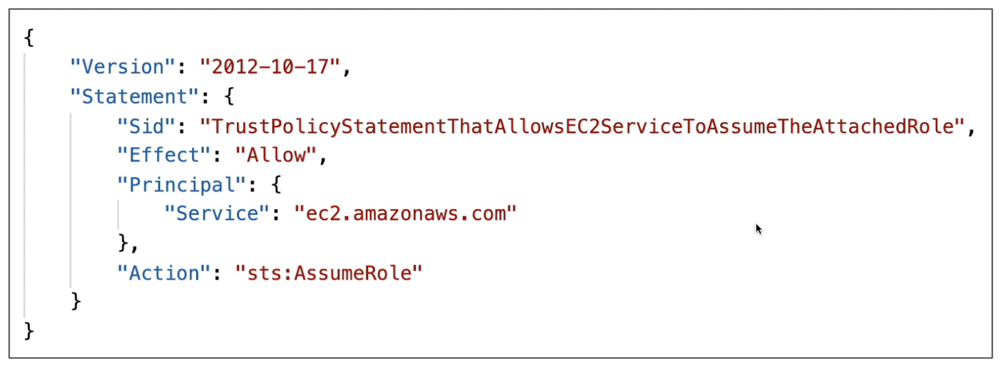
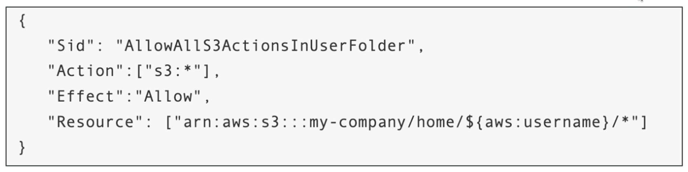

<h1> Things to do </h1>

- Provide date on which the document was last edited
- Provide reference for the information
- Provide video link for the hands-on labs
---

- [Introduction](#introduction)
- [Users and Groups](#users-and-groups)
- [Policies and Access Controls](#policies-and-access-controls)
    - [Policy Structure:](#policy-structure)
- [Account Authentication](#account-authentication)
  - [Password Policy](#password-policy)
  - [Multi-Factor Authentication (MFA)](#multi-factor-authentication-mfa)
- [IAM Roles (docs)](#iam-roles-docs)
- [IAM Auditing Tools](#iam-auditing-tools)
- [Policy Evaluation](#policy-evaluation)
- [Dynamic Policies](#dynamic-policies)
- [Best Practices](#best-practices)
- [Resources](#resources)

# Introduction
- [IAM](https://docs.aws.amazon.com/IAM/latest/UserGuide/introduction.html) stands for Identity and Acess Management
- It is used to centrally manage permissions on AWS resources.
- It is a Global service i.e all the functionalities provided by this service are impacted globally and aren't bounded by the regions.
- Although Global, The IAM service instances accross aws [partitions](https://docs.aws.amazon.com/whitepapers/latest/aws-fault-isolation-boundaries/partitions.html) have a hard-boundary and can't interact directly.
- With IAM, we can specify permissions on who (Users and Groups) can acess what (services and resources) under which conditions as well as the level of access it can have.
- By default the access is denied and is granted only when Permission specifies allow (This is also knwon as **Least Privilege Principle**).
- It is offered at no additional charge
  
# Users and Groups
- **User:** is an entity that represents a person or a workload which has a name and credentials through which it can authenticate.
- An account can have multiple users
  - **Root User**: User with the most access control over the account (only 1 per account).
  - **IAM Users**: the users under IAM service whose access control is defined by the permissions attached to it.
  - An IAM user with Administrative permissions is not same as root user. that means there is no way for an IAM user to be promoted as a root user.
  - By Default IAM Users do not have access to AWS Billing and Cost Management Console.
- **Group:** is an entity that is a collection of IAM Users.
- with the help of groups, permissions for multiple users can be defined at once
- Groups can not be nested
- A User can belong to multiple groups
- **There is a limit on number of users and group an account can have**

# Policies and Access Controls
- A Policy is a JSON document that defines the permissions for a user/group/role on a resource
- **Identity-based Policies:** The policies that specifies what an identity (User, Group or Role) can do and on which resource.
- **Resource-based Policies:** The policies that defines the permission on a resource
- A Custom defined Policy (except inline policies) can be Version controlled i.e it is possible to roll back to previous versions of policy.
### Policy Structure:
```json
{
    "Version": "2024-02-23", // Policy version, can be used to revert back this version

    "Id":"some-unqiue-string", // an Identifier for polciy - Optional

    "Statement":[{    // defines permission, can be one or more

        "Sid":"some-unqiue-string", // an Identifier for statement

        "Effect":"Allow", // Specfies wheather to allow access or deny

        "Principal": "arn", // The entity to which policy is applied to.
                            // A Group can't be a Principle

        "Action":"action", // The action that needs to be performed

        "Resource":"arn", // The resource on which action will be performed (the resource on which the policy is applied on)

        "Condition":{   // Defines the condition under which action needs to be performed, can be one or more

        "condition":{
                "key":"value" // key = attributes and value = the value that the attribute should have
                }
                
            }
        }
    ]
}
```
- ### Managed Policies and Inline Policies ([docs](https://docs.aws.amazon.com/IAM/latest/UserGuide/access_policies_managed-vs-inline.html#inline-policies))
  - **AWS Managed Policies:** Policies that are defined and managed by AWS
    - They are standalone Policies having their own ARN which includes Policy name in it.
    - Good for Administration related tasks.
  - **Customer Managed Policies:** Policies that can be customly defined by the user.
    - Can be Version Controlled
    - **Best-practice to define CMP**, start with an AWS Managed Policy if possible and later customize it.
  - **Inline Policies:** A policy created specifically for a User,Group or Role.
      - Can be of Max 2KB in size (can specify only few permissions)
    - They do not support Version Control
- ### Permission Boundary ([docs](https://docs.aws.amazon.com/IAM/latest/UserGuide/access_policies_boundaries.html))
  - A [Permission Boundary](https://www.youtube.com/watch?v=D-1u0dBM-q8) is a Policy over Permission Policy.
  - It defines the maximum access an indentity (User or role) can have from the access given to it by the Permission policy.
  - In order to access the resource, both Permission policy and Permission bounday must allow the access.
  - Can be used to prevent privilage escalation. 
  - **Permission boundary can only control access to the permissions defined in Permission Policy and can't allow any new access.**
  - i.e if the Permission boundary allows all access to S3 but the Permission Policy doesn't define any such access, than the access won't be granted.
  - **Permission boundaries are defined at User level hence groups can't use them.**

# Account Authentication
## Password Policy
- A Policy that defines the specification/structure a password should have
- for ex: minimum length, alphanumeric, letter casing, special characters etc
- It can also include other spcifications such as:
  - Allowing all IAM users to change their passwords
  - password expiry
  - prevent password reuse
  - Prevent Brute Force Attacks
## Multi-Factor Authentication (MFA)
- MFA = password + MFA token (a value which needs to be validated through the registered MFA device)
- MFA Devices:
  - **Virtual MFA Devices:** A virtual application
    - Google Authenticator (phone only)
    - Authy (multi-device)
  - **Universal 2nd Factor (U2F) Security Key:** A Physical Key
    - Yubikey: Support for multiple root and IAM users using a single security key
  - **Hardware Key Fob MFA Devices:**
    - Thales
  - **Hardware Key Fob MFA Devices for AWS GovCloud(US):**
    - SurePassId
  
# IAM Roles ([docs](https://docs.aws.amazon.com/IAM/latest/UserGuide/id_roles.html))
- It is similar to IAM User except it is not uniquely associated to one person
- An IAM Role lets any entity (i.e a service, a user from different account, a 3rd party user, an application etc) to assume itself as a User-entity in current account.
- **A Role can't be assigned to a group**
- This entities doesn't have a direct way to interact with resources hence they use IAM Roles as a deligate/interace to have that access.
- for ex: If an ec2-instance wants to have access to an S3 bucket, it can be assigned a role which has a policy attached to it defining the access control on S3.
- Here EC2-instance would be the user-entity and the S3 bucket would be the resource.
- The IAM Roles doesn't have traditional credentails like an IAM User instead it will create temporary credentials for all the entity that assumes the IAM Role and the credentials will expire at the end of session.
- **Service-linked Roles:** Pre-defined roles that are linked with the service and the resource (instance of the service). Includes all the permission the service requires to call other AWS services on your behalf.
- ### Trust Policies
  - Trust Policies are defined for roles
  - It specifies which Principles can assume the role it is attached with.
  - Every Role has two Policies, Permission Policy and Trust Policy hence Every Role is an Identity as well as a Resource simultaneously.
  
- ### Passing a Role to a Service
  - A role can be passed to a service when the service is being set up initially to create a resource, later when the resource requires to use any action allowed by the role, it can automatically assume the role.
  - For ex: If an Application running inside an EC2 needs to access S3 bucket, the role can be passed to the EC2 during its initail setup, later it can automatically assume the role whenever the app requires to access S3.
  - **A user should have `iam:PassRole` permission in order to pass a role to the service and `iam:GetRole` to view the role being passed**
- ***NOTE: Even though Roles and Resource based policies delegates access accross different regions, this regions must come under same partition!!. the access won't be delegated accross partitions.***

# IAM Auditing Tools
- They are used for reviewing information about the IAM users such as credentails, access permissions etc.
- **Credentials Report:** A Report that lists all the current account's users and the status for their various credentials.
  - A New report will be generated every 4 hours
  - Account Level Auditing Tool i.e can be used to audit all users under an account.
- **IAM Access Advisor:** It shows the service permissions granted to a user and when those service were last accessed by the user.   
  - Can be used to audit user permissions to follow Least Privilage Principle.
  - User Level Auditing Tool i.e can be used to audit single users at a time.

# Policy Evaluation
- Incase of multiple policies attached to a user, an explicit Deny on a resouce will be prioritized over an Allow.
- The permission on a resource is granted by considering both the permission to the user (Identity based policy) and permission on resource (Resource based policy).
- **Priority Level: Explicit Deny > Explicit Allow > Default Deny**

# Dynamic Policies
- Using AWS variables and wildcard characters
  

# Best Practices
- Root user should only be used for [tasks that only root user can perfrom](https://docs.aws.amazon.com/IAM/latest/UserGuide/root-user-tasks.html) otherwise try avoiding using it as much as possible.
- Any person that wants to be a user of the account should be granted access through IAM User only.
- Prioritize creating groups and using standalone policies rather than creating inline policies.
- Create a Strong password policy.
- Enforce Multi-factor Authentication for Root as well as IAM users.
- Use Roles for granting access to entites that can't interact directly with the account resources.
- Audit Permissions using Credentails Report and IAM Aceess Advisor respectively to follow least previlage principle.

# Resources
- [AWS IAM Docs](https://docs.aws.amazon.com/IAM/latest/UserGuide/introduction.html)
- [AWS Notes by Tahseer](https://arkalim.notion.site/IAM-e1b1d6d4287644b8874dd7614f3c6d49#fd868bc3e20c40a3818fa77334f76be7)